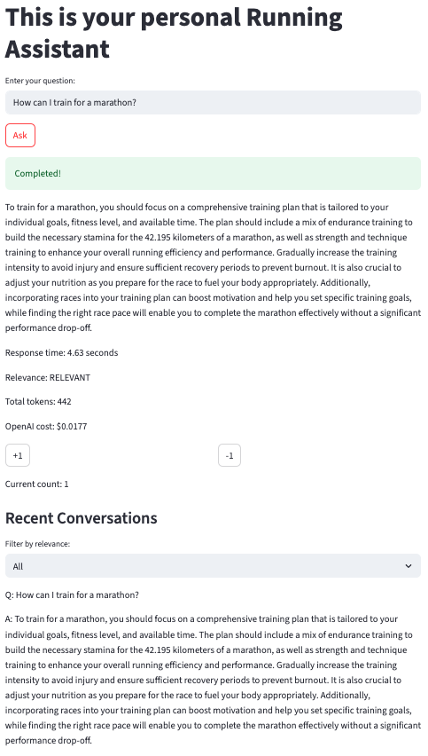
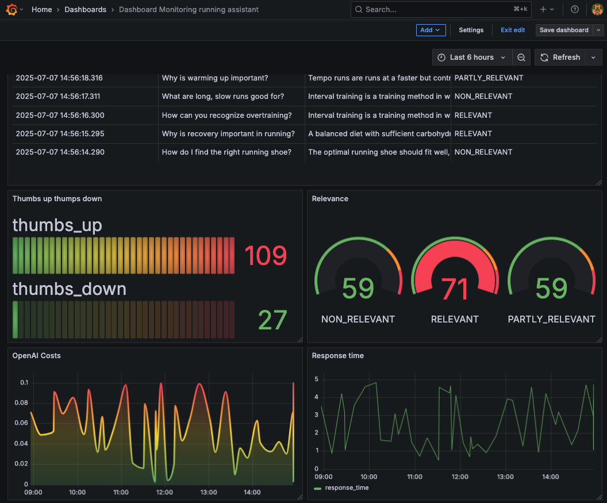

# Running Assistant – A Retrieval-Augmented Generation (RAG) App for Running-Related Questions


This project is a Retrieval-Augmented Generation (RAG) chatbot designed to assist users with questions related to running and training. It provides information on running techniques, training plans, recovery strategies, and more. The application is intended for demonstration and experimentation purposes and serves as an interactive FAQ or personal coach for runners.

The Running Assistant App for Running-Related Questions implements a Streamlit-based personal running assistant that answers user questions by combining document retrieval with generative AI. It includes the following components:

- Uses Qdrant as a vector database for embedding storage and semantic search.
- Retrieves relevant FAQ entries from a Qdrant vector collection based on the user's query.
- Builds a prompt by combining the retrieved documents with the user's question.
- Sends the prompt to the GPT-4o language model to generate a coherent response.
- Orchestrates the full RAG pipeline — from retrieval to answer generation.
- Provides an interactive interface via a Streamlit web app for interacting with the assistant.
- Logs user queries, generated answers, and rich metadata including feedback, OpenAI costs, token counts, response times, and relevance to a PostgreSQL database for traceability and monitoring.
- Utilizes Grafana for real-time visualization of key metrics such as token usage, response latency, and user feedback trends.

The underlying FAQ document used for retrieval were created using the GPT-4o model.

# Teck stack

- **Qdrant:** Vector database used to store and retrieve document embeddings for semantic search in the RAG pipeline.
- **OpenAI API:** Provides large language model capabilities (GPT-4o) for generating responses and augmenting user queries with natural language understanding.
- **Streamlit:** Lightweight Python framework used to build the interactive web interface for the application.
- **Docker:** Containerization platform used to package and deploy the entire application stack in isolated, reproducible environments.
- **PostgreSQL:** Relational database used to store structured data such as user sessions, logs, and configuration settings.
- **Grafana:** Monitoring and visualization tool used to display metrics, logs, and performance dashboards connected to the backend.

# Project structure

```text
.
├── app/                     # Streamlit app and backend
│   ├── app.py               # Streamlit UI and logic
│   ├── db.py                # PostgreSQL access & schema
│   ├── generate_data.py     # Synthetic data generator
│   ├── prep_db.py           # Qdrant indexing & DB setup
│   ├── rag.py               # RAG pipeline
│   └── requirements.txt
├── data
│   ├── docs_with_ids.json   # documents for indexing
│   ├── documents.json
│   ├── ground_truth_data.csv   # ground truth for evaluation
├── grafana
│   ├── dashboards.json      # Dashboard settings for monitoring
├── notebooks
│   ├── ground-truth-data.ipynb      # Generating ground truth data
│   └── offline_evaluation.ipynb.    # Retrieval evaluation (hit rate/mrr), cosine similiarity, LLM as a judge
├── .env
├── docker-compose.yml
├── Dockerfile
├── Makefile
├── Pipfile
├── Pipfile.lock
└── README.md
```

# System Architecture

Qdrant Indexing Pipeline: The script `prep_db.py` initializes and populates a Qdrant vector collection using question-answer documents and embeddings generated by `jinaai/jina-embeddings-v2-small-en` model. It also loads ground truth data and sets up the associated PostgreSQL database. Designed for use in retrieval-augmented generation (RAG) workflows, this pipeline enables efficient semantic search over indexed documents.

- Loads question-answer documents and ground truth data
- Initializes a Qdrant collection with the defined vector size and distance metric
- Generates embeddings for documents using the specified model handle
- Builds and upserts Qdrant-compatible point structures with payload metadata
- Initializes the PostgreSQL database schema using init_db()

# Get started

Follow these steps to set up and run the Running Assistant App.

Make sure you have docker and and Python 3.12 installed. For this project Python Version 3.12.1 and docker Version 27.5.1-1 were used.

**Install dependencies**

Use `make setup` to install `pipenv` and all required Python packages:

```bash
make setup
```

**Activate Python Environment**

Enter the virtual environment created by `pipenv`:

```bash
pipenv shell
```

**Set your OpenAi API Key**

To use the RAG application, you need an OpenAI API key. You can create one in your OpenAI account dashboard.

Once created, set your key in .env file

```bash
OPENAI_API_KEY=YOUR_OPENAI_API_KEY
```

or export the key as an environment variable.

```bash
export OPENAI_API_KEY='YOUR_OPENAI_API_KEY'
```

**Build docker images**

Make sure Docker and Docker Compose are installed on your system.

To get the Running Assistant application and its dependent services up and running, you can use Docker Compose. This will build and launch the necessary containers for Qdrant, PostgreSQL, Streamlit app, and Grafana.

Build all docker images:

```bash
docker compose build
```

Start all services

```bash
docker compose up
```

This will start the following containers:

**qdrant:** Vector search database on port `6333`
**postgres:** PostgreSQL database on port `5432`
**streamlit:** The Running Assistant frontend on port `8501`
**grafana:** Monitoring dashboard on port `3000`

Access the application and services:

**Streamlit app:** http://localhost:8501
**Grafana dashboard:** http://localhost:3000 (login with user=admin and password=admin)

# Vector Search with Qdrant

This project uses Qdrant as a vector database to enable semantic search over running-related FAQ documents. Qdrant handles both indexing and similarity search in a single engine optimized for embeddings.

If you run Qdrant the first time, download the Qdrant Docker image. This only needs to be done once.

```bash
docker pull qdrant/qdrant
```

You can launch a local Qdrant container using Docker

```bash
make run_qdrant
```

Wait a few seconds for Qdrant to fully initialize before continuing.
You can test if it’s running with:

```bash
curl http://localhost:6333
```

**Index Running FAQ Documents and initialize the PostgreSQL database schema**

To populate the `running-questions` collection in Qdrant with structured FAQ documents and initialize the PostgreSQL database schema, you can run the indexing pipeline.

Use the following make command to start the indexing process

```bash
make qdrant_indexing
```

Alternatively, you can run the script directly.

```bash
python app/prep_db.py
```

The `prep_db.py` file handles the initialization and population of a Qdrant vector database
collection with embedded documents for semantic search. It loads question-answer
documents and ground truth data, generates vector embeddings using the `jinaai/jina-embeddings-v2-small-en` model, creates or resets the Qdrant collection, and upserts the document embeddings with associated metadata. Additionally, it initializes the PostgreSQL database schema.

The script performs the following:

The `prep_db.py` script handles the complete setup of your semantic search infrastructure. It performs the following tasks:

- Loads question-answer documents and ground truth data from the data/ directory
- Initializes a fresh Qdrant collection with vector configuration (using cosine distance and 512-dimensional embeddings)
- Embeds documents using the jinaai/jina-embeddings-v2-small-en model
- Builds and upserts vector points into Qdrant, attaching metadata as payloads
- Initializes the PostgreSQL database schema by executing the init_db() function
- Logs all key steps and metrics for debugging and monitoring
- Database initialization

POSTGRES_HOST Setting

To run the indexing script outside of Docker, you must override the `POSTGRES_HOST` environment variable:

```bash
export POSTGRES_HOST=localhost
```

Inside Docker, the `POSTGRES_HOST=postgres` refers to the container name as defined in the Docker network.
However, when you run the script on your local machine (outside of Docker), it needs to connect to PostgreSQL via localhost. Failing to change this will result in a connection error because your host system doesn’t recognize postgres as a valid hostname.

Then execute the script to initialize the qdrant vector database and PostgreSQL database schema.

```bash
python app/prep_db.py
```

**Conversation & Feedback Database Module**

The module `app/db.py` provides utility functions for managing conversation and feedback data in a PostgreSQL database for the Running Assistant application. It enables schema initialization, saving of user interactions, and retrieval of stored data for analysis or monitoring.

- Initializes the database schema with conversations and feedback tables.
- Saves structured user conversation data along with token usage, costs, and evaluation metadata.
- Stores user feedback linked to specific conversations.
- Retrieves recent conversations and aggregates feedback statistics.

This module is used as part of a larger application pipeline, such as during the Qdrant indexing process or inside the Streamlit frontend.

**Running Assistant Streamlit Application**

This Streamlit app serves as the user interface for the Running Assistant, a retrieval-augmented generation (RAG) application designed to answer running-related questions with semantic search.

The following features are supported:

- User Interaction: Users input questions and receive AI-generated answers in real-time.
- Conversation Logging: Each interaction is saved with detailed metadata, including token usage and response times.
- Feedback Collection: Users can provide positive or negative feedback on answers, which is stored for quality monitoring.
- Recent Conversations: Displays a list of recent user queries filtered by relevance.
- Feedback Statistics: Shows aggregated counts of positive and negative feedback for ongoing evaluation.

To access the application:

- **Streamlit app:** http://localhost:8501

Enter a question and click "Ask" to get an answer. Use the +1 / -1 buttons to provide feedback on the response. Browse recent conversations and monitor feedback stats directly within the app.



**Generate Test Data**

Populate the database with synthetic data (for Grafana testing).

```bash
python app/generate_data.py
```

This will

- generate historical data from the past 6 hours
- Continiousloy simulate live conversations and feedback

Use Ctrl+C to stop live data generation.

**Dashboard**

Access Grafana at http://localhost:3000 to explore:

- Latest requests
- Feedback trends
- Token usage ans OpenAI costs
- Response time

