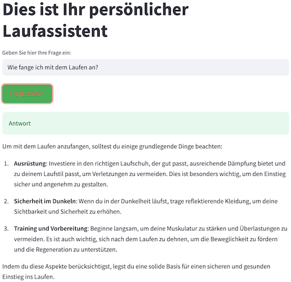

# Running Assistant – A Retrieval-Augmented Generation (RAG) App for Running-Related Questions


This project is a Retrieval-Augmented Generation (RAG) chatbot designed to assist users with questions related to running and training. It provides information on running techniques, training plans, recovery strategies, and more. The application is intended for demonstration and experimentation purposes and serves as an interactive FAQ or personal coach for runners.

The Running Assistant App for Running-Related Questions implements a Streamlit-based personal running assistant that answers user questions by combining document retrieval with generative AI. It includes the following components:

- Retrieves relevant FAQ entries from a Qdrant vector collection based on the user's query.
- Builds a prompt by combining the retrieved documents with the user's question.
- Sends the prompt to the GPT-4o language model to generate a coherent response.
- Orchestrates the full RAG pipeline — from retrieval to answer generation.
- Provides an interactive interface via a Streamlit web app for interacting with the assistant.

The underlying FAQ document used for retrieval is written in German and were created using the GPT-4o model.

# Get started

Follow these steps to set up and run the Running Assistant App:

**Install dependencies**

Use `make setup` to install `pipenv` and all required Python packages:

```bash
make setup
```

**Activate Python Environment**

Enter the virtual environment created by `pipenv`:

```bash
pipenv shell
```

**Set Your OpenAI API Key**

To use the RAG application, you need an OpenAI API key. You can create one in your OpenAI account dashboard.

Once created, export the key as an environment variable:

```bash
export OPENAI_API_KEY='YOUR_OPENAI_API_KEY'
```

## Vector Search with Qdrant

This project uses Qdrant as a vector database to enable semantic search over running-related FAQ documents. Qdrant handles both indexing and similarity search in a single engine optimized for embeddings.

If you run Qdrant the first time, download the Qdrant Docker image. This only needs to be done once.

```bash
docker pull qdrant/qdrant
```

You can launch a local Qdrant container using Docker

```bash
make run_qdrant
```

Wait a few seconds for Qdrant to fully initialize before continuing.
You can test if it’s running with:

```bash
curl http://localhost:6333
```

**Index Running FAQ Documents**

Populate the `running-questions` collection in Qdrant with structured documents:

```bash
make qdrant_indexing
```

This step initializes a local Qdrant vector database collection and populates it with embeddings generated from running-related question-answer documents. The documents are loaded from `documents.json`, and embedded using the `jinaai/jina-embeddings-v2-small-en` model.

The script performs the following:

- Deletes any existing running-faq collection.
- Creates a new collection configured for cosine similarity.
- Embeds and indexes all documents into Qdrant for efficient vector-based search.

Ensure Qdrant is running locally on `http://localhost:6333` before executing this step.

**Launch the Running Assistant App**

Start the Streamlit-based interface for your personal running assistant:

```bash
make running_assistant
```

This will automatically open a new page in your web browser.
There, you can enter your questions and receive context-based answers related to running.


